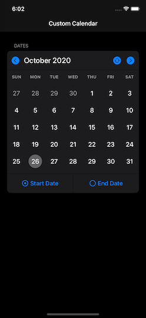

# Задача
Необходимо написать контролл для наглядного выбора диапазона дат в календаре.

# Описание
• Календарь должен находиться внутри ячейки таблицы UITableView.
• В календаре по умолчанию отображается текущий месяц текущего года.
• По умолчанию выбранный и отмеченный диапазон дат - с текущего по текущее число.
• Отображаемый месяц можно изменить на другой, например с помощью кнопок переключения на следующий/предыдущий.
• Соответственно, начало или окончание диапазона дат может быть не ограничено текущим месяцем.
• Должна быть кнопка сброса месяца и диапазона на значения по умолчанию.
• Календарь должен отображать названия дней недели.
• Календарь должен поддерживать автоматические локализации и региональные настройки (к примеру, для стран, где началом недели считается воскресенье).
• Смена месяца должна перестраивать высоту контента таблицы, если необходимо (если изменилось количество недель).
• Календарь должен поддерживать поворот экрана и ночной режим интерфейса.
• Минимальная версия iOS - любая, предпочтительно 13 и новее.
• Только самописный код, без использования сторонних библиотек и фреймворков календарей.
• Принимаются любые способы добиться результата: через коллекции, через стеки внутри стеков, через автолейаут (с VFL или без).
• Приветствуется следование общим принципам Apple Human Interface Guidelines. 

# Task
It is necessary to write a control for visual selection of the date range in the calendar.

# Description
• The calendar must be inside a UITableView table cell.
• The default calendar displays the current month of the current year.
• By default, the selected and marked date range is from current to current date.
• The displayed month can be changed to another, for example by using the next / previous buttons.
• Accordingly, the start or end of the date range may not be limited to the current month.
• There should be a button to reset the month and range to default values.
• The calendar should display the names of the days of the week.
• The calendar must support automatic localizations and regional settings (for example, for countries where the start of the week is Sunday).
• Change of month should rebuild the height of the table content if necessary (if the number of weeks has changed).
• Calendar must support screen rotation and night mode interface.
• The minimum version of iOS is any, preferably 13 and newer.
• Only self-written code, without using third-party libraries and calendar frameworks.
• Any ways to achieve the result are accepted: through collections, through stacks within stacks, through auto-layout (with or without VFL).
• Adherence to the general principles of the Apple Human Interface Guidelines is encouraged.

